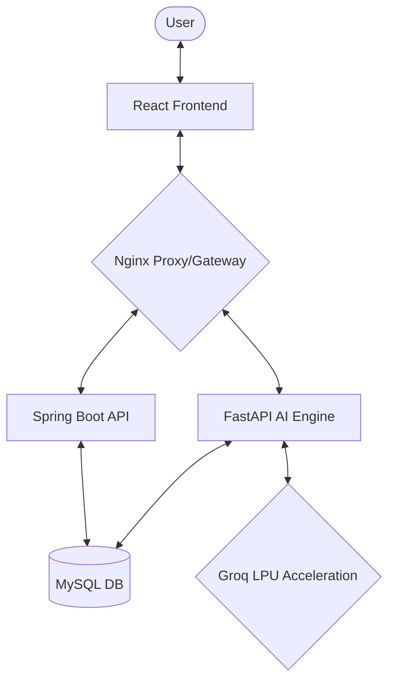

# 🛡️ ContentShield: AI-Powered SNS Governance Solution

[](http://localhost:8080)
[](https://frontend-react-production-1e78.up.railway.app)
[]()

ContentShield는 유튜브(YouTube)를 포함한 SNS 콘텐츠의 유해성을 실시간으로 모니터링하고 분석하는 AI 기반의 통합 거버넌스 솔루션입니다. 

---

## 🚀 서비스 바로가기
**📍 포트폴리오 URL**: [https://frontend-react-production-1e78.up.railway.app](https://frontend-react-production-1e78.up.railway.app)

---

## 📝 프로젝트 개요
수많은 온라인 콘텐츠 속에서 혐오 발언, 욕설, 위협 등을 자동으로 탐지하고, 사용자가 부정적인 문장을 긍정적이고 정중한 표현으로 개선할 수 있도록 돕습니다. 마이크로서비스 아키텍처(MSA)를 통해 확장성과 유지보수성을 극대화하였습니다.

---

## 🛠 기술 스택 (Tech Stack)

### Backend & AI
- **Spring Boot 3.2**: 비즈니스 로직, JWT 보안, JPA 엔티티 관리
- **FastAPI**: Python 기반 AI 추론 엔진 (Groq & LangChain)
- **Groq LLM**: Llama-3.1-8B (분석), Llama-Guard-3 (안전 필터)
- **LangChain**: Text-to-SQL을 활용한 지능형 통계 데이터 추출

### Frontend
- **React**: 상태 관리 및 실시간 분석 대시보드
- **Tailwind CSS**: 모던하고 직관적인 UI 디자인

### DevOps & Database
- **CI/CD**: Jenkins, Docker, Docker Compose (WSL2 기반 연동)
- **Database**: MySQL, MariaDB
- **Cloud**: Railway (Full-stack Deployment)

---

## ✨ 핵심 기능 (Key Features)

### 1. 전수 조사 및 실시간 수집 (YouTube Comment Crawling)
- 영상 URL 입력만으로 수천 개의 댓글을 실시간 스크래핑 (`youtube-comment-downloader` 활용).
- 상대 시간 파싱 및 중복 수집 방지 알고리즘 적용.

### 2. AI 듀얼 모델 유해성 분석
- **Llama-Guard-3**: 글로벌 안전 정책에 따른 유해 카테고리(S1~S13) 1차 필터링.
- **Llama-3.1-8B**: 6대 유해 지표(독성, 비속어, 위협 등) 정밀 점수화 및 AI 분석 이유 생성.

### 3. AI Writing Assistant
- 유해 문장을 **5가지 대화 톤**(공손함, 친근함, 격식 등)으로 자동 교정 제안.
- 영상 맥락에 기반한 건설적인 답변 템플릿 생성 보조.

### 4. 지능형 통계 리포트 (Text-to-SQL)
- 자연어 질의를 통한 데이터베이스 분석. 
- *"지난주 유해도가 가장 높은 악플러 3명 알려줘"* ➔ **SQL 자동 생성 및 실행 ➔ 분석 결과 보고서 출력**.

---

## 🏗 시스템 아키텍처 (Architecture)



---

## 📦 설치 및 실행 방법 (Installation)

### 1. Repository Clone
```bash
git clone https://github.com/yoonhj9622/contentshield.git
cd contentshield
```

### 2. 환경 변수 설정 (.env)
- `backend-fastapi/.env` 파일에 AI API 키 등록:
```env
GROQ_API_KEY=your_key_here
```

### 3. Docker Compose 실행 (로컬 환경)
```bash
docker-compose up --build
```

---

## 🛠 배포 및 CI/CD (DevOps)
- **WSL2(Ubuntu)** 환경에 구축된 **Jenkins**를 통해 자동 빌드 및 배포 수행.
- **Docker-in-Docker(DinD)**를 활용하여 젠킨스 파이프라인 내부에서 컨테이너 이미지화 자동화.
- **Railway Cloud**를 통한 무중단 배포 및 SSL(SNI) 보안 통신 적용.